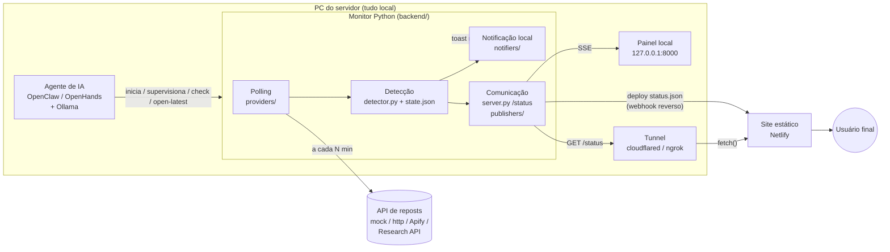

# Arquitetura e fluxo

## Componentes



| Módulo (RNF-03) | Arquivos | Responsabilidade |
|---|---|---|
| Polling | `providers/*.py`, `http.py` | Consultar a API, normalizar itens, retry/backoff |
| Detecção | `detector.py`, `state.py` | Comparar com IDs vistos, persistir `last_item_id`, histórico |
| Notificação local | `notifiers/*.py`, `dashboard/` | Toast nativo, abrir navegador, painel em tempo real |
| Comunicação com o site | `server.py`, `status.py`, `publishers/*.py` | `/status` via tunnel, deploy do `status.json`, webhook |
| Orquestração | `monitor.py`, `cli.py`, `agent/` | Loop, CLI com códigos de saída, integração com o agente |

### Por que o polling não é feito pelo próprio LLM

O agente de IA é o orquestrador, mas cada ciclo de polling é executado por código determinístico.
Um modelo local levaria segundos (ou minutos) para “decidir” algo que é uma comparação de IDs, e
poderia errar. Com essa divisão o agente **executa ações** (RF-09) — inicia o processo, força
checagens, reage ao código de saída `10`, abre o vídeo — sem gastar inferência a cada 3 minutos.

## Fluxo completo (exemplo)

Configuração: `TIKTOK_USERNAME=perfil_exemplo`, `POLL_INTERVAL_SECONDS=180`, tunnel Cloudflare ativo.

1. **Início** — o job do OpenClaw roda `repost_monitor doctor`; como `servidor_no_ar` é `false`, executa
   `scripts/start.ps1 -Background`. O monitor sobe em `127.0.0.1:8000`.
2. **Leitura de base** (10:00:00) — a API devolve 12 reposts. Todos entram em `seen_ids`, `last_item_id = 74123…`.
   Nenhum alerta. Log: `Leitura de base: 12 repost(s) existentes de @perfil_exemplo registrados (sem alerta).`
3. **Ciclos sem novidade** (10:03, 10:06…) — `Nenhum repost novo de @perfil_exemplo (12 itens consultados).`
4. **Falha de rede** (10:09) — 3 tentativas com espera de 2s e 4s; o ciclo falha, `falhas_consecutivas = 1`.
   Se a API responder 429 com `Retry-After: 600`, o próximo ciclo espera 600s. Após sucesso, o intervalo volta a 180s.
5. **Repost detectado** (10:12:04) — a API devolve um ID novo `74999…` no topo:
   - `state.json`: `last_item_id = 74999…`, detecção salva com `detected_at = 10:12:04Z`;
   - `logs/reposts.jsonl`: `{"timestamp": "…10:12:04Z", "monitorado": "@perfil_exemplo", "url": "https://www.tiktok.com/@autor/video/74999…"}`;
   - toast do Windows: **“@perfil_exemplo repostou um vídeo!”** (clicar abre o vídeo);
   - painel local muda na hora (Server-Sent Events) para **“Repost detectado agora mesmo”**;
   - se `NETLIFY_*` estiver configurado, o monitor faz o deploy do `status.json` novo;
   - se `WEBHOOK_URL` estiver configurado, envia o POST.
6. **Site** — o `app.js` na Netlify consulta `https://status.seudominio.com/status` a cada 30s. Às 10:12:30
   recebe `"repostou": true`, mostra o banner vermelho e o modal “@perfil_exemplo repostou um vídeo!” com
   o botão **Abrir vídeo**. Ao clicar em “Entendi”, o ID é salvo no `localStorage` e o modal não reaparece.
7. **Agente** — no próximo disparo, o OpenClaw roda `check`; se receber saída `10`, executa `open-latest`
   e responde `Repost novo: <url>`.
8. **Fim da janela** (11:12) — passados `ALERT_WINDOW_MINUTES`, `/status` volta a `"repostou": false`
   (`Aguardando repost`), mantendo `ultimo_repost` para consulta.

## Contrato do `GET /status`

```json
{
  "repostou": true,
  "username": "perfil_exemplo",
  "user_id": null,
  "alvo": "@perfil_exemplo",
  "status": "repost_detectado",
  "mensagem": "Repost detectado há 2 minutos",
  "minutos_desde_repost": 2,
  "ultimo_repost": {
    "item_id": "7499912345678901234",
    "url": "https://www.tiktok.com/@autor/video/7499912345678901234",
    "author": "autor",
    "description": "legenda do vídeo",
    "cover_url": "https://…",
    "created_at": "2026-09-27T21:00:00Z",
    "detected_at": "2026-09-28T10:12:04Z"
  },
  "reposts_recentes": [ … até 10 … ],
  "ultima_verificacao": "2026-09-28T10:12:04Z",
  "ultima_verificacao_ok": "2026-09-28T10:12:04Z",
  "proxima_verificacao": "2026-09-28T10:15:07Z",
  "erro": null,
  "falhas_consecutivas": 0,
  "intervalo_polling_segundos": 180,
  "janela_alerta_minutos": 60,
  "monitor_online": true,
  "gerado_em": "2026-09-28T10:14:10Z"
}
```

`status` pode ser `iniciando`, `aguardando`, `repost_detectado` ou `erro`.
O mesmo formato é usado no `status.json` publicado na Netlify e no corpo do webhook.

## API local (somente no PC)

| Rota | Descrição |
|---|---|
| `GET /` | Painel |
| `GET /api/state` | Status + provedor, total de verificações, resultado da última publicação |
| `GET /api/detections` | Histórico (até 50) |
| `GET /api/events` | Server-Sent Events (`status`, `repost`) |
| `POST /api/check-now` | Executa um ciclo agora e devolve o resultado |
| `POST /api/test-notification` | Toast de teste |
| `POST /api/open-latest` | Abre o último vídeo no navegador do PC |
